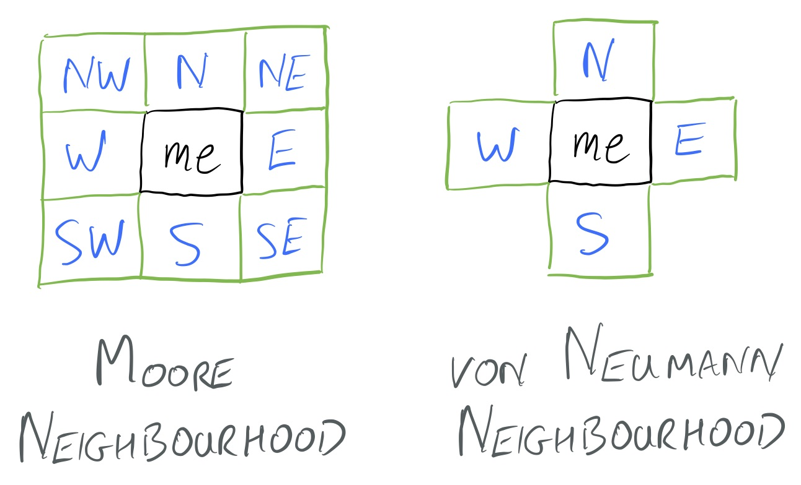

# Macquarie University, Department of Computing #

## COMP332 Programming Languages 2017 ##

## Hipster: a programming language for specifying cellular automata ##

### Introduction ###

A *[cellular automaton](https://en.wikipedia.org/wiki/Cellular_automaton)* consists of a regular (finite or infinite) grid of cells laid out as a multi- (often 2-) dimensional array. Each cell can contain one of a finite number of different values, such as ``off`` and ``on`` or the numbers from ``0`` to ``15`` for example. Furthermore, each cell is surrounded by a finite set of cells, called its *neighbourhood*, defined relative to (and including) that cell.

A cellular automaton *evolves* through time, which we think of being broken up into a sequence of discrete time steps or *generations* ``t = 0, 1, 2, ....``. It is initialised with a given starting state or *configuration*, specifying the initial state of the automaton at generation ``0``. It then evolves from one generation to the next according to some simple *updating rules*, which specify the contents of a cell in generation ``t+1`` in terms of the contents of its neighbourhood in generation ``t``. Usually, the rule for updating cells is the same for each one and does not change over time,

Cellular automata we originally discovered and studied by [Stanislaw Ulam](https://en.wikipedia.org/wiki/Stanislaw_Ulam) and [John von Neumann](https://en.wikipedia.org/wiki/John_von_Neumann) in the 1940s. However, they remained an academic curiosity until the 1970s when [John Conway](https://en.wikipedia.org/wiki/John_Horton_Conway) invented the [Game of Life](https://en.wikipedia.org/wiki/Conway%27s_Game_of_Life), a 2-dimensional automaton.

In recent years cellular automata have been used to model a wide variety of important physical and biological phenomena. Some physicists, including Nobel prize winner [Gerard 't Hooft](https://en.wikipedia.org/wiki/Gerard_%27t_Hooft), have proposed that cellular automata may provide a foundation for a unified theory of quantum mechanics and gravitation. Others have even suggested that the universe itself may be a gigantic cellular automaton. ;)

### The Game of Life ###

[Conway's game of life](https://en.wikipedia.org/wiki/Conway%27s_Game_of_Life) is by far the most well-known and well-studied cellular automaton. It is "played" on a (potentially infinite) 2-dimensional square grid, and each of its cells can be in one of two states ``alive`` or ``dead``. Whether a cell is alive in generation  ``t+1`` depends on the number of cells that are alive in its _Moore neighbourhood_ in generation ``t``.

The precise rules for updating from one generation to the next are:

1. Any live cell with fewer than two live neighbours dies (under-population).
2. Any live cell with two or three live neighbours lives on to the next generation.
3. Any live cell with more than three live neighbours dies (overpopulation).
4. Any dead cell with exactly three live neighbours becomes a live cell (reproduction).

The remarkable thing is that these very simple rules actually give rise to surprisingly complex behaviour. Part of the _game_ in the game of life is to setup a starting configuration of live cells and then see how it evolves across the generations. Many configurations die out in a couple of generations, others fall into a stable and repeating configuration of patterns, and yet others grow without bounds or grow to a large size and then die off slowly. It is this property of _emergent complexity_ from simple rules that has made cellular automata a popular pass-time and tool in sciences, like biology, where complexity abounds.

You can find many game of life simulators online, and we encourage you to explore the world of cellular automata by spending a few minutes playing with one of these. One such was used as an exercise in Java programming in COMP229 half a decade ago, and you can access the simple simulator that arose from that work at [Dom's GoL simulator](https://bitbucket.org/dominicverity/gameoflife). 

### Turing patterns ###

A nice example of a cellular automaton used to demonstrate a biological model is one designed to demonstrate the emergence of [Turing patterns](https://www.wired.com/2011/02/turing-patterns/). Here again simple rules lead to complex behaviour. In this case simple interactions between two chemicals, called _activator_ and _inhibitor_, give rise to complex patterns in the organisation of cells, colours on the skins of animals, and maybe even in the structure of galaxies. 

In the cellular automaton version of Turing's morphogenesis, each cell on a square grid represents a cell of an animal. Such cells possess two numbers which are intended to represent the concentrations of the activator and inhibitor chemicals at given point in time. The rules for updating to the next point in time are chosen to simulate the production / absorption of these chemicals by cells and the diffusion of those chemicals from areas of high to areas of low concentration.

We say that a cell is _activated_ if the concentration of activator in that cell is greater than the level of inhibitor. In the simulation you can download from [Dom's Turing Pattern Generator](https://bitbucket.org/dominicverity/turing-pattern-generator) active cells are displayed in yellow and inactive ones in black, and by selection of different rates of diffusion it gives rise to patterns very reminiscent of the shapes found in the pelts of big cats or the surfaces of corals.

### The Hipster programming language ###

The _Hipster_ programming language is a [domain specific language (DSL)](https://en.wikipedia.org/wiki/Domain-specific_language) that has been designed as a tool for specifying and exploring cellular automata. It is an [imperative](https://en.wikipedia.org/wiki/Imperative_programming) language based on a number of experimental cellular automata languages that have emerged over the years, such as [(j)Trend](http://www.complex.iastate.edu/download/Trend/) and [CAOS](https://pdfs.semanticscholar.org/023c/d739963210853d8b83599ea90c1450273a89.pdf) for example . Indeed, the name Hipster has been chosen as a pun on Trend(y).

Simulations of cellular automata may, and of course have, been written in general purpose languages such as Java and C. So it is natural to ask what the advantages of a specialised cellular automaton DSL are over simulations written in these more familiar languages. Some arguments in favour of a DSL like Hipster are:

1. It allows experimenters writing to concentrate only on specifying the cell update rules of their cellular automate. They don't need to know, or care, about details that are superfluous to them, like the precise order that cells are updated in, whether updates are made in serial or parallel (by many processor cores say), how results are rendered for display and so forth. This makes it easier for experimenters who are not programming experts to write cellular automata and it makes the code they write both simpler and easier to debug.

2. It gives the DSL compiler much more latitude to optimise the code it generates. If the cellular automaton writer is unconcerned about the precise way that updating code is executed, that gives the compiler lots of possibilities to "jiggle" things around to suit a particular execution environment. Whether updates are done in a single loop, broken down into separate loops and allocated to separate processors, whether updates are reordered relative to each other, how memory is shared and updated, when the state of the automaton is rendered to the screen and so forth are all decisions the compiler can make to optimise performance. Were we to specify the same automaton in C the experimenter would have to make all those decisions, and they would be hard to change in the future.

3. A DSL of this kind can be re-targeted to produce code for a whole range of exotic machine architectures. For example, the graphics hardware of most modern PCs is really just a huge array of very simple processing blocks. So the DSL compiler could be written to generate code that dedicated each one of those blocks to updating a single cell of the automaton. Similar arguments apply to the generation of code to execute cellular automata on [Field Programmable Gate Arrays (FPGA)](https://en.wikipedia.org/wiki/Field-programmable_gate_array), these being chips containing millions of re-configurable logic components each one of which may be devoted to the update of a single cell. Cellular automata are well suited to massively parallel execution of this kind, but the specific details need not trouble the experimenter.

4. A DSL can restrict the bad things that an experimenter can do. For example, the updating rule for a single cell should be simple enough to execute very quickly. After all, any useful cellular automaton simulation will have to execute millions (or billions) of these every second. So it would be a disaster if the experimenter wrote cell updating code that included time consuming loops or, indeed, failed to terminate. The DSL can restrict these possibilities by, for example, limiting the kinds of loops that it allows or preventing the use of recursive functions that may never terminate.

The Hipster language is intended to deliver many of these advantages. For our purposes in COMP332, it is designed to be simple to use and largely to generate code to run on the Java Virtual Machine (JVM). It could, however, easily be re-targeted to generate code for FPGAs and graphics arrays.

### The Game of Life written in Hipster ###

The following annotated implementation of the Game of Life exposes many of the peculiarities of the Hipster language:

    // Hipster cellular automaton language.
    //
    // Conway's game of life written in Hipster.
    //
    // (C) 2017, Dominic Verity, Macquarie University, All rights reserved.
    // 
    // This Source Code Form is subject to the terms of the Mozilla Public
    // License, v. 2.0. If a copy of the MPL was not distributed with this
    // file, You can obtain one at http://mozilla.org/MPL/2.0/.

    // Constant declarations giving the size of the automaton.
    // All variable declarations at top level are assumed constant.

    int width = 100;
    int height = 100;

    // Declare the dimensions of the automaton.
    // The `cyclic` suffix specifies that a dimension should
    // "wrap around" at its boundary (as in the video game Asteroids).

    dimension(width cyclic, height);

    // Declare the symbols used to refer to neighbouring cells.
    // At any point the runtime keeps track of the location of a *current*
    // cell. In the following declaration the locations of neighbours
    // are specified relative to that current cell, which is always
    // referred to by the name `me`.

    neighbourhood   // specify a Moore neighbourhood.
      N = [0,1], S = [0,-1], W = [-1,0], E = [1,0],
      NE = [1,1], SE = [1,-1], SW = [-1,-1], NW = [-1,1];

    // Declare the state information that each cell possesses.
    // For the game of life this comprises a single boolean value
    // which contains `true` if the cell is alive and `false` if
    // it is dead.

    state {
      boolean alive = false;  // default state of a cell is dead.
    }

    // The expressions `SE:alive` and `N:alive` refer to the values of
    // the `alive` field of the `SE` and `N` neighbours of the current cell
    // (in the current generation). The expression `alive` or `me:alive`
    // refer to the value of the `alive` field of the current cell.

    // In updater code we may make assignments to the fields of the current
    // cell but not to those of its neighbours. Those assignments are made to
    // the state of the cell in the *next* generation.

    // Declare the updater function.
    // During the update from one generation to the next
    // this code is called once for each cell in the simulation.

    updater {
      // Initialise counter of live neighbours.
      int count = 0;

      // Count cells that are alive.
      // The `others` keyword specifies iteration over all cells in
      // the neighbourhood except for the central cell.

      iterate current over others  
        if current:alive then count = count+1;

      // Set new state of cell according to the GoL updating rules.
      // If no explicit assignment is made to a state field then
      // the current value of that field is automatically copied to
      // the next generation.

      if alive && (count < 2 || count > 3) then alive = false;
      if !alive && count == 3 then alive = true;
    }

    // Declare some colour constants. Colours are represented by sRGB
    // integers comprising three 8-bit fields giving blue (bits 0-7),
    // green (bits 8-15) and red (bits 16-23) colour channel intensities.

    int black = 0;
    int white = 0xFFFFFF;  // Hexadecimal integer notation.

    // Declare the colour mapper function.
    // Returns a colour integer computed from the state of the
    // current cell. This colour is then used when displaying the state
    // of that cell on the screen. Code in this mapper is not allowed to
    // change the state of current cell.

    mapper {
      if alive then return(white); else return(black);
    }

    // Declare a function to place a "glider" at a specified location.

    function glider(int row, int col) {
      cell [row, column]
        iterate nbr over [N, E, SW, S, SE]
          nbr:alive = true;
    }

    // Note that the last function uses the `cell` statement. This sets the
    // current cell to a specified location and then executes the associated
    // statement (an `iterate` statement in this case). The body of the 
    // iterate loop also makes assignments to the state of neighbouring cells.
    // These operations are only allowed when initialising the automation.
    // They are not allowed during updating, the updater should only change
    // the value of the current cell and can only depend upon the values of 
    // cells in the immediate neighbourhood.

    // Declare initialisers. There can be more than one of these, each one
    // is named and the particular initialiser to run at the start of the
    // simulation can be selected by the user (default is the first listed).

    // This initialiser places a single glider in the centre of the grid.

    initialiser singleGlider {
      glider(height / 2, width / 2);
    }

    // This initialiser places 4 gliders at various equidistant points.

    initialiser fourGliders {
      glider(height / 4, width / 4);
      glider(3 * height / 4, width / 4);
      glider(height / 4, 3 * width / 4);
      glider(3 * height / 4, 3 * width / 4);
    }

### The structure of Hipster code ###

Hipster builds upon familiar principles in the design of imperative languages. A Hipster program comprises a sequence of _top level declarations_ which can be of the following constructs:

#### Declarations of global constants. ###

These are of the familiar form:

    int width = 100;

These can be of type `boolean`, `int` (32-bit integer) or `float` (double precision floating point). They can also be declared to be of type `neighbour`, such constants name locations in the neighbourhood of the current cell.

Hipster does not allow global variables, since doing so would allow information to be stored when visiting one cell and then used in updating another distant and unrelated cell. This would violate the rule that the state of a cell in the next generation should only depend on the states of the cells in its neighbourhood in the current generation.

What is more, Hipster makes no guarantees about the order in which cells will be updated and so the use of global variables in the cell updater function would lead to unpredictable behaviours.

#### Declarations of functions. #### 

These are constructs that start with the keyword `function`, like so:

    function myFunc(int p1, float p2, neighbour p3) : boolean {
      ...   // body statements
    }

Such a function can return a value of type specified after the `:` using the `return` statement,  and can either be called from within expressions (if they have a return type) or as statements (if they have no return type). Functions can only be called from source code locations after the closing brace of their bodies, so in particular they cannot call themselves recursively. 

#### A dimension declaration ####

This declaration specifies how many cells wide each dimension is:

    dimension(100 cyclic, 200);
    
In principle a cellular automaton could have an arbitrary number of dimensions, but the compiler we will build will only allow 1-D and 2-D automata. A dimension can be declared ``cyclic`` meaning that it wraps around at its edges, so cells on one side of that dimension are direct neighbours with corresponding cells on the opposite side. 

#### A neighbourhood declaration ####

A declaration of the following form

    neighbourhood   // specify a Moore neighbourhood.
      N = [0,1], S = [0,-1], W = [-1,0], E = [1,0],
      NE = [1,1], SE = [1,-1], SW = [-1,-1], NW = [-1,1];

describing the neighbourhood of a cell. This introduces a symbolic name (constant binding of type `neighbour`) for each neighbour and specifies the location of that neighbour in coordinates relative to the current cell. In this example, defining a Moore neighbourhood, we have used a traditional compass point naming scheme for neighbouring cells.

The `neighbourhood` declaration will not allow a binding of a symbol to the coordinate `[0,0]` of the current cell. Instead it binds the symbol `me` to refer to the current cell. If another name is preferred for the current cell then the `me` neighbour can be aliased by a top level, constant binding after the `neighbourhood` declaration:

    neighbour new_me = me;

### An updater declaration ###

A declaration of the following form 

    updater {
      ..... // body statements
    }

which specifies the code which computes and sets the new state of the current cell in the next generation using its state information and the states of its neighbours. To update the simulation from one generation to the next this will be executed by its runtime exactly once for each cell. The runtime does not guarantee the order in which cells are updated, indeed it doesn't even guarantee that those updates are even made by the same machine. It could even run your automaton on a massive network of computers connected via the internet!

### A colour mapper declaration ###

The colour mapper provides a way for the simulation to translate the state of each cell into something that can be displayed on the screen. A mapper is declared using a top level declaration of the following form

    mapper {
      ..... // body statements
    }
    
which, in essence, simply declares a specialised function whose return value in an `int`. Each cell will be displayed as a small square group of pixels in the simulator's window and the colour of that cell will be given by the integer returned on applying the mapper function to the state of that cell. Colours are represented by sRGB integers comprising three 8-bit fields giving blue (bits 0-7), green (bits 8-15) and red (bits 16-23) colour channel intensities. So the colour mapper

    int black = 0;
    int white = 0xFFFFFF;

    mapper {
      if alive then return(white); else return(black);
    }

given in the game of life example will cause a cell of the simulation to be displayed as a group of pixels in the colour white if it is alive and in the colour black if it is dead.

In order to facilitate the construction of these sRGB integers, Hipster allows programmers to use hexadecimal notation for integers and provides a number of utility functions for bit-wise manipulations of integers 

### Initialiser declarations ###

Initialisers provide a mechanism that allows the Hipster programmer to specify how the starting state (at time ``t=0``) of a simulation will be setup. There may be any number of initialisers in a Hipster program, and these are introduced using a top level declaration of the following form:

    initialiser <name> {
      ..... // body statements
    }

An individual using a Hipster simulator can select the particular initialiser to apply at the beginning of a simulation run from a drop down by name.

Initialisers are slightly special beasts. The code they can legally contain is subject to far fewer constraints than the code that can appear in an updater. For example, it can use `for` loops and `cell` statements to iterate over the entire simulation grid and set the states of many cells. What is more, it can either set cells to pre-specified starting values or it can use a random number generator to randomly assign values to cells. The Hipster semantic analyser is constructed to ensure that the more permissive constructs that can appear in initialisers are rejected if they occur in the body of an updater or in the body of any function called from that updater.

### The grammar for top level declarations ###

We may summarise the syntactic aspects of the top level structure of a Hipster program in the following grammar:

    program : topleveldecl+
    
    topleveldecl : vardecl
                 | fundecl
                 | dimdecl
                 | neighbourdecl
                 | updaterdecl
                 | mapperdecl
                 | initdecl
    
    tipe : "boolean" | "int" | "float" | "neighbour"
    
    vardecl : tipe idndef ("=" expr)? ";"
    
    idndecl : tipe idndef
    
    idndecllist : empty
                | idndecl ("," idndecl)* 
    
    fundecl : "function" idndef "(" decllist ")" (":" tipe) "{" statement* "}"
    
    dim : expr "cyclic"?
    
    dimdecl : "dimension" "(" dim ("," dim)* ")" ";"
    
    nbrdef : idndef "=" coordexpr
    
    neighbourdecl : "neighbourhood" nbrdef ("," nbrdef)* ";"
    
    statedecl : "state" "{" vardecl* "}"
    
    updaterdecl : "updater" "{" statement* "}"
    
    mapperdecl : "mapper" "{" statement* "}"
    
    initdecl : "initialiser" idndef "{" statement* "}"
 
### Expressions in Hipster ###

Expressions in Hipster may involve values of type `boolean`, `int`, `float` or `neighbour` and the language provides a fairly standard set of operators for manipulating these. These are summarised in the following grammar fragment:

    expr : expr "&&" expr       // boolean binary operators
         | expr "||" expr
         | expr "==" expr       // relational operators
         | expr "<=" expr
         | expr ">=" expr
         | expr "<" expr
         | expr ">" expr
         | expr "+" expr        // arithmetic binary operators
         | expr "-" expr
         | expr "*" expr
         | expr "/" expr
         | expr "%" expr        // remainder operator
         | "!" expr             // unary operators
         | "-" expr
         | "+" expr
         | "(" expr ")"         // bracketed expression
         | funapp
         | idnuse
         | idnuse ":" idnuse    // reference to neighbour state variable
         | "true"
         | "false"
         | intconst
         | floatconst
         
    funapp : idnuse "(" (empty | expr ("," expr)*) ")"  // function application.
    
Hipster also provides a special expression type which is used for specifying coordinates in `cell` statements and `neighbour` declarations:

    coordexpr : "[" expr ("," expr)* "]"

This grammar is, of course, ambiguous as it stands, and it is disambiguated by the following precedence and associativity rules:

1. The following expression constructs have precedence as shown from lowest to highest with constructs on the same line having the same precedence:
    * boolean operators
    * relational operators
    * addition and subtraction
    * multiplication and division
    * all other kinds of expression 

2. All binary expression operators are left associative, except for the relational operators which are not associative.

### Statements in Hipster ###

The statements provided by Hipster will mostly be familiar. The primary novelties are a specialised statement for iterating over sets of neighbours, a construct for referring to cells by their location on the simulation grid and a case construct which can match ranges of integer and neighbour values. As discussed above, the Hipster semantic analyser restricts the use of some of these constructs within the cell updater function or any function (indirectly) called from there.

The grammar governing the statements understood by the Hipster parser follows, interspersed with brief explanations of what each statement does:

    statement = vardecl
              | block
              | ifstmt
              | iteratestmt
              | forstmt
              | returnstmt
              | cellstmt
              | assignstmt
              | funcallstmt
              | emptystmt

The syntax of variable declarations (`vardecl`) is the same as that of the top level constants discussed above. Variables are local to the immediately enclosing block. They are scoped lexically and their extent ranges from the end of their declaration to the end of the immediately enclosing block. A block is simply a sequence of statements enclosed by a pair of curly braces (`{` and `}`):

    block : "{" stmt* "}"
    
    emptystmt : ";"
    
Assignment statements have the syntax:

    lvalue : idnuse | (idnuse ":" idnuse)

    assignstmt : lvalue "=" expr ";"
    
At run-time this evaluates the expression on the right and assigns the resulting value to the `lvalue` on the left. An `lvalue` can be a locally defined variable, a state field, or a pair `<neighbour>:<state field>` which specifies a state field of a neighbour of the current cell. we should note that:

* If a state field is referred to in an expression it evaluates to the value of that field in the **current** generation.
* If a state field is assigned to in an assignment statement then its value is set in the **next** generation.
* It is a semantic error to assign to assign a value to the state of a neighbour of the current cell in the updater function or in any function it calls.

We have already seen that functions can be called from within expressions. They can also be called as a statement with the same syntax

    funcallstmt : funapp ";"
    
this form executes the given function call and discards any returned result. A return statement

    returnstmt : "return" "(" expr? ")" ";"
    
specifies an immediate return of control from the body of a function to its call sight. The expression provided specifies the return value, which must be of the type declared in the top level function declaration or can be absent if no return type was specified. Every control path in the body of a function must contain a `return` statement.
    
The conditional `if` statement obeys a traditional semantics and its `else` branch is optional:

    ifstmt : "if" expr "then" statement ("else" statement)?

We handle the dangling `else` ambiguity in the usual way. 

The `for` loop in Hipster obeys the following syntax

    forstmt : "for" idndef "=" expr "to" expr ("step" expr)? statement

and it follows the strict semantics imposed by languages like Pascal. In particular:

* The identifier after the `for` keyword is a defining instance of a variable of type `int` whose extent is the statement comprising the body of the loop.
* The control expressions (from, to and optionally step) of a `for` loop are evaluated to values only once on loop entry.
* It is an error to make an assignment to the control variable of a `for` loop within the extent of its body.

Use of `for` loops is forbidden in the updater function or functions (indirectly) called from it. The use of `for` loops in update contexts can result in very long cell update times, and is generally unnecessary. The primary use of `for` loops is in initialiser code, where they are used to iterate over and initialise large collections of cells. 

It is, however, common for updater functions to iterate over (a subset of) the neighbours of the current cell, so Hipster provides a specialised control structure for that purpose:

    neighbourset : "all"
                 | "others"
                 | "[" idnuse ("," idnuse)* "]"
    
    iteratestmt : "iterate" idndef "over" neighbourset statement

A `neighbourset` specifies a set of neighbours to iterate over, which can be either:

* `all` meaning cells in the neighbourhood including the current cell,
* `others` meaning all cells in the neighbourhood except for the current cell,
* a specified set of neighbours given as a comma separated list between square brackets.

An `iterate` statement follows similar semantic rules to a `for` loop, viz:

* The identifier given after the `iterate` keyword is a defining instance of a variable of type `neighbour` whose extent is the statement comprising the body of the loop.
* It is an error to make an assignment to the control variable of an `iterate` loop within the extent of its body.

The effect of running an `iterate...over` statement is that it iterates over the specified set of neighbours, setting its control variable to each one in turn and then executing its body statement. So for example the code

    int count = 0;
    iterate current over others
      if current:alive then count = count+1;

counts all those cells that are alive in the neighbourhood of the current cell (excluding that cell itself) and the code

    iterate nbr over [N, E, SW, S, SE]
      nbr:alive = true;
      
iterates over the neighbour cells to the immediate _north_, _east_, _south west_, _south_, and _south east_ of the current cell and switches them to being alive. Note here that this second statement would only be legal within an initialiser, since it body makes assignments to the states of cells other than the current cell.

Another statement that is only allowed in the context of initialiser functions is the `cell` construct:

    cellstmt : "cell" coordexpr statement
    
The expression immediately after the `cell` keyword specifies the coordinate of a cell on the simulation grid and that cell is made the current cell for the execution of the following body statement. The cell updater should only have access to the current cell and it immediate neighbours, a rule that use of the `cell` construct in an updater would clearly break.

---
[Dominic Verity](http://orcid.org/0000-0002-4137-6982)  
Last modified: 9 August 2017  
[Copyright (c) 2017 by Dominic Verity. Macquarie University. All rights reserved.](http://mozilla.org/MPL/2.0/)

